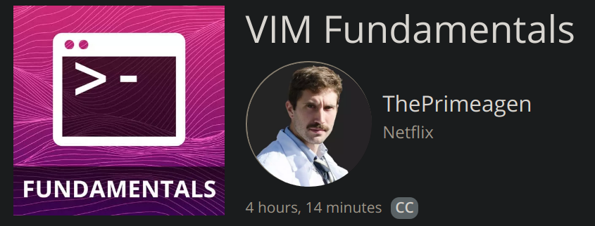

#### I have talked about this before, but why do I care?

 
 
 
 
 
 
 
 
 
 
 
 

 
 
 
 
 
 
 
 
 
 
 
 

 
 
 
 
 
 
 
 
 
 
 
 

[Vim Fundamentals](https://frontendmasters.com/courses/vim-fundamentals/)

 
 
 
 
 
 
 
 
 
 
 
 

### Who am I?

* I am priviledged enough to tell you I work at Netflix and work on Network
  Stuff (http2, ws, other ones in the works now).
* I stream on [Twitch](twitch.tv/ThePrimeagen).
* I make meme's and informative videos on [YT](youtube.com/ThePrimeagen)
* Married to a beautiful wife
* 4 kids

 
 
 
 
 
 
 
 
 
 
 
 
