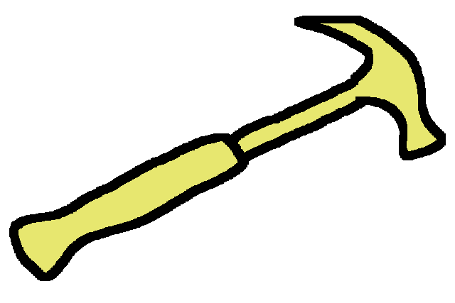

### First let me give you an example

<br />
<br />
<br />
<br />
<br />
<br />
<br />
<br />
<br />
<br />
<br />
<br />

From [Acrolinux](https://arcolinux.com/everthing-you-need-to-know-about-tmux-servers-and-sessions/)


<br />
<br />
<br />
<br />
<br />
<br />
<br />
<br />
<br />
<br />
<br />
<br />

### Why use one?



<br />
<br />
<br />
<br />
<br />
<br />
<br />
<br />
<br />
<br />
<br />
<br />

### Install tmux
```
sudo apt install tmux
```

```
brew install tmux
```
