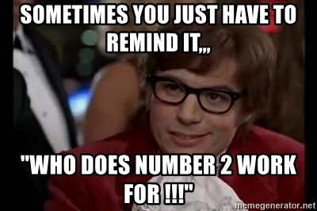

### Warning
Some of my items will be slightly different than yours because I have a tmux rc
that has been refined.  You can have one too!  I'll even talk about it shortly,
but for the sake on less confusion, lets start with just tmux then we will get
to some of the rc

#### Why show you the commands
There may come a day when you want to write a little optimized script!
Everything has both the command and a key.  The command line interface for tmux
is very complete and you can do a lot of things.

<br />
<br />
<br />
<br />
<br />
<br />
<br />
<br />
<br />
<br />
<br />
<br />

### Lets open a terminal and start tmuxing

<br />
<br />
<br />
<br />
<br />
<br />
<br />
<br />
<br />
<br />
<br />
<br />

```
tmux list-sessions

# If you got excited
tmux kill-server
```

<br />
<br />
<br />
<br />
<br />
<br />
<br />
<br />
<br />
<br />
<br />
<br />

```
tmux
```

### What actually happens here? (Draw it out)

<br />
<br />
<br />
<br />
<br />
<br />
<br />
<br />
<br />
<br />
<br />
<br />

### Lets close the terminal

<br />
<br />
<br />
<br />
<br />
<br />
<br />
<br />
<br />
<br />
<br />
<br />

```
tmux a
tmux attach
```

<br />
<br />
<br />
<br />
<br />
<br />
<br />
<br />
<br />
<br />
<br />
<br />

### Terminology
Prefix Key
* The key combo you press (default `C-b`).
* Draw it out

<br />
<br />
<br />
<br />
<br />
<br />
<br />
<br />
<br />
<br />
<br />
<br />

### Creating sessions

```
tmux kill-server
```

```
tmux list-sessions
```

```
tmux
```

```
tmux list-sessions
```

```
tmux #errors
tmux new-session #errors
```

```
tmux new-session -d
```

```
tmux list-sessions
```

<br />
<br />
<br />
<br />
<br />
<br />
<br />
<br />
<br />
<br />
<br />
<br />

#### Navigation tip
I don't use this personal, but this is a thing that is good to know.

* to the next session `<prefix>-(`
* to the prev session `<prefix>-)`

<br />
<br />
<br />
<br />
<br />
<br />
<br />
<br />
<br />
<br />
<br />
<br />

### Close and create new session
```
tmux kill-server
tmux new-session # equivalent to tmux
```

<br />
<br />
<br />
<br />
<br />
<br />
<br />
<br />
<br />
<br />
<br />
<br />

### Lets close our tmux (but not really)!
Lets use `<prefix>-d`

#### Reattach

```
tmux a #ttach
```

<br />
<br />
<br />
<br />
<br />
<br />
<br />
<br />
<br />
<br />
<br />
<br />

### Navigation tip
You can see all of the sessions and their windows by pressing `<prefix>-w`

#### Create a bunch of windows
That way we can really see what happened there.  For you to do this on your own
use detach in conjunction with `tmux new-session` command

#### Fun fact, C-d vs prefix-d
C-d = EOF
prefix-d = tmux detach

<br />
<br />
<br />
<br />
<br />
<br />
<br />
<br />
<br />
<br />
<br />
<br />

### So those are sessions
it may be hard to see the difference between a session, a window, and a pane.

<br />
<br />
<br />
<br />
<br />
<br />
<br />
<br />
<br />
<br />
<br />
<br />

### Lets talk about windows

#### Clean everything up.
```
tmux kill-server
```

<br />
<br />
<br />
<br />
<br />
<br />
<br />
<br />
<br />
<br />
<br />
<br />

### Creating Windows

```
tmux
tmux new-window
```

this is equivalent to `<prefix>-c`

#### Navigation tip
* `<prefix>-n` for next window
* `<prefix>-p` for prev window
* `<prefix>-#` for the # window

#### Usefulness tip
A session should contain *like* items.

<br />
<br />
<br />
<br />
<br />
<br />
<br />
<br />
<br />
<br />
<br />
<br />



<br />
<br />
<br />
<br />
<br />
<br />
<br />
<br />
<br />
<br />
<br />
<br />

### You can name sessions and windows
```
tmux new-session -d -s "foofoo"
```
```
tmux new-window -n "fooooo"
```

#### Usability tip
You cannot have sessions with the same name

<br />
<br />
<br />
<br />
<br />
<br />
<br />
<br />
<br />
<br />
<br />
<br />

### There are panes
You can definitely look into panes to be able to split your view.  I just
haven't really got into that.  I find it a pane in the ass..

<br />
<br />
<br />
<br />
<br />
<br />
<br />
<br />
<br />
<br />
<br />
<br />

From [Acrolinux](https://arcolinux.com/everthing-you-need-to-know-about-tmux-servers-and-sessions/)


<br />
<br />
<br />
<br />
<br />
<br />
<br />
<br />
<br />
<br />
<br />
<br />

### Have we solved this?


<br />
<br />
<br />
<br />
<br />
<br />
<br />
<br />
<br />
<br />
<br />
<br />
