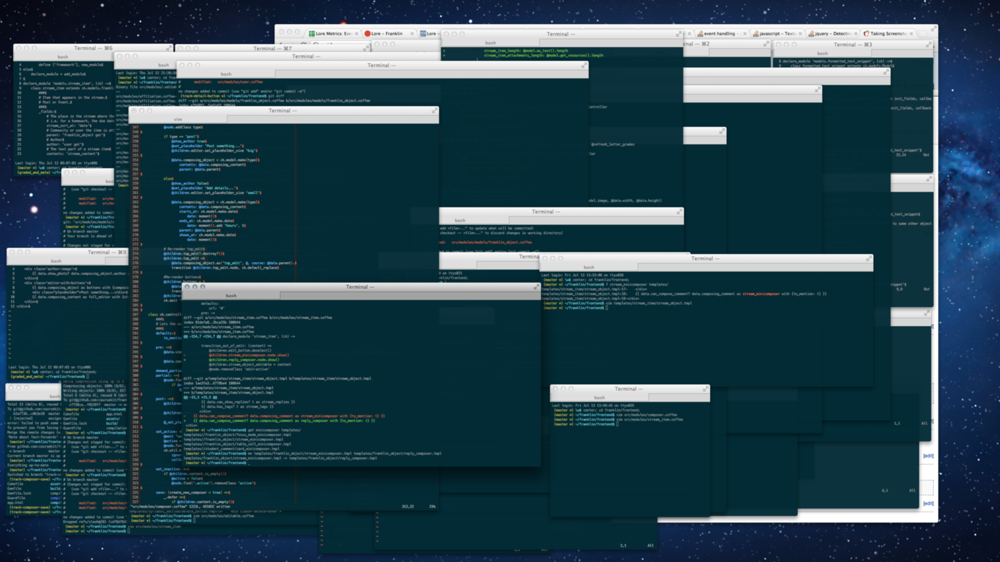

This is my jam.

 
 
 
 
 
 
 
 
 
 
 
 

### What is the terminal vs shell
* Terminal - psuedo-terminal.  Something that does the reads and the writes.
* Shell - The command line interpreter.  This does the actual program starting
          and interpretation of the command line language (zsh for example)

 
 
 
 
 
 
 
 
 
 
 
 

### What do I use?
xterm
* meat and poe - tay - toes  

tmux
* This separates the terminal you are using from the shell that is running.  

 
 
 
 
 
 
 
 
 
 
 
 

 
 
 
 
 
 
 
 
 
 
 
 

### So lets get started
This is where I think the fun really starts!!!
