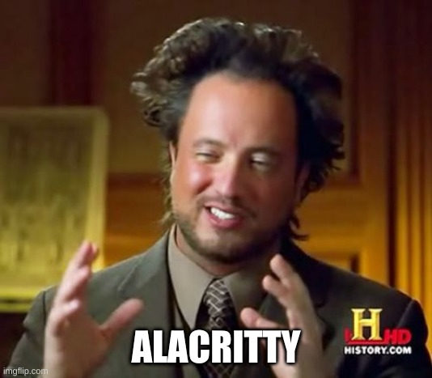
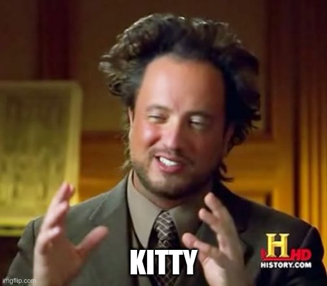

This is my jam.

 
 
 
 
 
 
 
 
 
 
 
 

### What do I use?
xterm
* meat and poe - tay - toes  

tmux
* This separates the terminal you are using from the underlying session/shell running.

 
 
 
 
 
 
 
 
 
 
 
 

 
 
 
 
 
 
 
 
 
 
 
 

### So lets get started
This is where I think the fun really starts!!!

 
 
 
 
 
 
 
 
 
 
 
 

### A little story about me
And my love of the terminal. 
 

Like any good story... it didn't start that way.

 
 
 
 
 
 
 
 
 
 
 
 

### I wont be recommending a terminal emulator today

I use xterm.  It was developed in 1984.

 
 
 
 
 
 
 
 
 
 
 
 

 
 
 
 
 
 
 
 
 
 
 
 

 
 
 
 
 
 
 
 
 
 
 
 

### So what are we going to talk about?
I am going to talk about multiplexing your terminal to cure your terminal
overloading woes.  We will eventually build a tool around it and live that
harpoon lifestyle.

 
 
 
 
 
 
 
 
 
 
 
 
